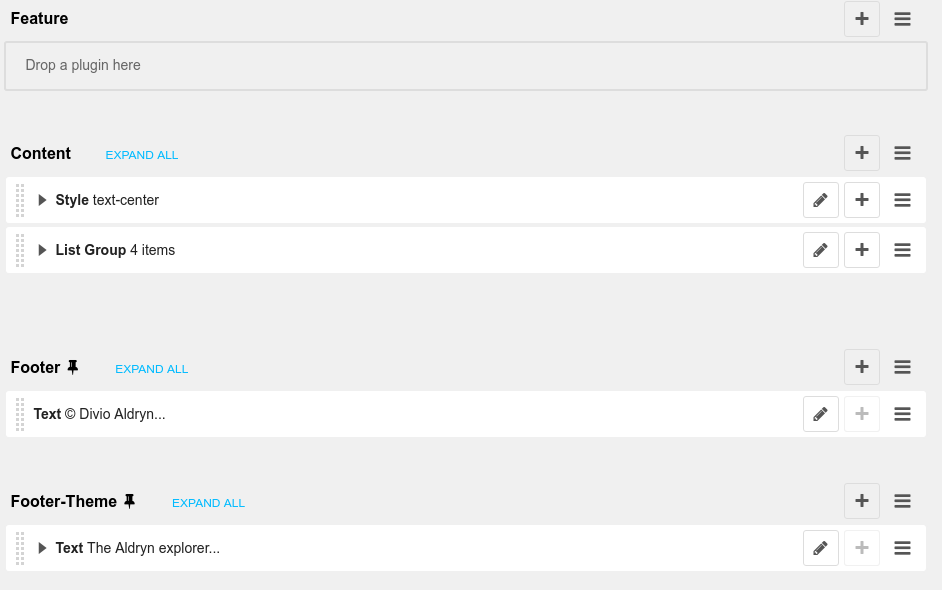

.. title: DjangoCMS

:data-transition-duration: 500
:css: css/presentation.css
:css: css/monokai.css

----

:id: intro


.. class:: quote

    "Django" y "CMS"
    
.. note::
    *Qué es Django CMS*. Antes, es necesario explicar las 2 palabras que componen su nombre: Django, y CMS.

----

:id: cms

CMS
===

Content Management System
-------------------------
Adm. de contenidos, para los administradores, editores, participantes y demás usuarios del sitio.

.. note::
    CMS: permite a los editores añadir, editar y gestionar contenido. Por ejemplo, noticias.

----

:id: django-def

Django
======

.. class:: quote

    "The web framework for perfectionists with deadlines"
    
.. note::
    Es un framework para el desarrollo web en Python.

----

:id: framework-def

Framework
=========
Estructura conceptual y tecnológica de soporte definido, normalmente módulos concretos y herramientas para el desarrollo.
    
.. note::
    ¿Y qué es un framework? Un método de trabajo establecido haciendo uso de unas herramientas predefinidas.
    
----

:id: django-features

Algunas de las herramientas que ofrece Django...
================================================

* Admin
* CRM (models.py)
* Templates
* Sis. vistas genéricas (views.py)
* Middleware
* Sis. de urls (urls.py)
* Sistema de usuarios...

.. note::
    ¿Y qué herramientas son esas? En el caso de Django, algunas de estas son...

----

:id: djangocms-def

DjangoCMS:
==========

Complementa a Django como framework
-----------------------------------

Pero con herramientas para CMS
^^^^^^^^^^^^^^^^^^^^^^^^^^^^^^

.. note::
    Ahora, perdonad el rodeo. DjangoCMS lo que hace es complementar el framework de Django con herramientas para CMS.

----

:id: djangocms-features

Herramientas que ofrece DjangoCMS
=================================

* Sistema de menús jerárquico y multiidioma.
* Gestión y creación de páginas.
* Borradores y publicación de contenido.
* Sistema de versiones.
* Contenido multiidioma y condicionado por el mismo.
* Gestión de los Apphooks y los plugins (que hablaremos más adelante).

.. note::
    Qué herramientas nos ofrece DjangoCMS:

----

:id: demo-1

Una pequeña demostración...
===========================

.. note::
    Y ahora una pequeña demostración para que se vea de qué hablamos...

----

:id: cms-howto

Cómo usar DjangoCMS
===================

Podemos usar DjangoCMS en un proyecto Django ya existente con muy pocos cambios.

* Añadir los componentes al :code:`INSTALLED_APPS`.
* Añadir los middleware y context processor.
* Añadir al :code:`urls.py`.
* Etiquetas DjangoCMS en template base.
* Definir templates.

|

Más información: http://docs.django-cms.org/en/release-3.4.x/how_to/install.html

----

:id: cms-templates-changes

Cambios en templates
====================

En el template base, debemos poner las etiquetas:

* ``placeholder/placeholder_static``
* ``show_menu``

----

:id: placeholder-def

Placeholder
===========
Permite definir dónde irán los plugins (bloques, widgets).

.. code:: htmldjango

     
     <div class="jumbotron">
         
     </div>
     <div>
         
     </div>
     <div>
         
     </div>
    
    
    
    <div id="footer">
        
    </div>
    
    
El identificador (primer argumento) permite reutilizar secciones entre diferentes templates.
    
----

:id: placeholders-types

Placeholder y placeholder_static
--------------------------------

Además, podemos diferenciar entre:

* **Placeholder static:** Va asociado a una página en concreto o contenido. Por ejemplo, un artículo de blog sobre un concierto, puede tener al lado un plugin de botón para reservas.
* **Placeholder:** Se muestra en todas las páginas que tengan el identificador de placeholder, sin diferenciar contenido. Por ejemplo, un plugin que se mostrará en TODOS los artículos de blog, con publicidad.
    
----

:id: placeholder-static-ex

Ejemplos de placeholder static
==============================

* Un placeholder **footer**, que se hereda en todos los templates, que tendrá un plugin de texto con el aviso legal de la página.
* Un placeholder **blog_header** que se usa sólo en los templates de una app blog.
* Un placeholder **blog_article_comments**, que se mostrará sólo en el template de article de blog.
   

----

:id: placeholder-ex

Ejemplos de placeholder
=======================

* Un placeholder **content**, que es donde va el contenido de un artículo o noticia.
* Un placeholder **feature**, que irá al lado del artículo. Por ejemplo, "¡Reserva ya las entradas para este evento!"
   
----

Al editar una página, podremos visualizar los placeholders en los que podremos añadir plugins.



----

:id: show-menu-def

Show_menu
=========

Renderiza los menús de DjangoCMS.

.. code:: htmldjango

    <ul class="nav navbar-nav">
        
    </ul>

----

:id: cms-dev

Desarrollo con DjangoCMS
========================

Tenemos principalmente:

- Apphooks
- Plugins

|

Además de otras herramientas como:

- Menús
- Wizards
- ...

.. note::
    Y ahora, cómo usar las herramientas de DjangoCMS...

----

:id: apphooks-def

Apphooks
========

Similares a las apps de Django, tienen un ``urls.py```, mismos views, mismos templates... pero con la posibilidad de añadirlos de forma dinámica asociados a una url de partida. Por ejemplo, /blog/.

Ejemplos:

* Una app **blog**. Podremos añadir tantos apps blogs a nuestra web como queramos.
* Una app **personas**. Pueden añadirse varias apps, cada una filtrando qué tipo de personas se mostrarán  (por ejemplo, app personas "socios", y app personas "junta directiva").
* Una app **encuestas** que permite añadir múltiples encuestas. A su vez habrá plugins que permitirán incluir una encuesta en una página.


----

:id: apphooks-usage

Cómo se añaden en la interfaz
=============================

Creando una página nueva. Por defecto, DjangoCMS crea páginas de **CONTENIDO**, pero es posible cambiarlo para que sea una app.

1. Se crea una página **blog**, con url ``/blog/``.
2. Tras crearse la página, se va a *avanzado* y se elige la app, en este caso la de blog.
3. Ahora la página es una app, y las urls partirán de la url base de la página.

----

:id: apphooks-ex

Ejemplos:
---------

* **/blog/**: portada del blog.
* **/blog/c/software-libre**: Categoría software libre.
* **/blog/ahora-uso-django-cms/**: Entrada en el blog.

----

:id: create-apphook

Crear una AppHook
=================

Adaptando Django polls, app del tutorial de Django
--------------------------------------------------

Convertiremos una app de Django en una AppHook de DjangoCMS, para poder añadirla dinámicamente con la interfaz web.

Primero veremos cómo es la App original antes de modificarla.

|

.. class:: warning

    *Ojo:* Pueden aprovecharse las herramientas de DjangoCMS sin necesidad de que la app sea una AppHook. Esto es sólo para poder añadirlo dinámicamente.

----

:id: apphook-polls-intro

Nuestra App *polls* tiene:

* Un archivo ``models.py`` con el esquema de la base de datos y los métodos .
* Un archivo ``admin.py`` con  las clases para administrar los modelos.
* Un archivo ``views.py`` con las funciones y clases que procesan las peticiones web, para devolver unas respuestas.
* Un archivo ``urls.py`` que relaciona las urls con las vistas que ejecutarán.
* Un directorio ``templates/`` con los archivos html para visualizar el resultado de las vistas.

----

:id: demo-2

Echemos un vistazo...
=====================

----

:id: apphook-polls-urls

Convirtiendo nuestra App en un AppHook
======================================

Primero, comentaremos del archivo ``proyecto/urls.py`` la importación de nuestro urls, porque ya no lo necesitaremos. Ahora lo gestionará DjangoCMS con su AppHook.

.. code:: python

    from django.conf.urls import url, include
    from django.contrib import admin

    urlpatterns = [
        url(r'^admin/', admin.site.urls),
        url(r'^polls/', include('polls.urls')),  # <-- la comentamos
    ]

----

:id: apphook-polls-cms-apps

cms_apps.py
===========
En este archivo se definen los AppHooks que se podrán añadir desde la interfaz web. En nuestro caso:

.. code:: python

    # cms_apps.py
    from cms.app_base import CMSApp
    from cms.apphook_pool import apphook_pool
    from django.utils.translation import ugettext_lazy as _


    class PollsApphook(CMSApp):
        name = _("Polls Apphook")

        def get_urls(self, page=None, language=None, **kwargs):
            return ["polls.urls"]  # Ahora el urls de la app se carga con esto

    apphook_pool.register(PollsApphook)

----

:id: demo-3

Eso es todo
==========
Tras esto nuestra App ya es un Apphook. Sin más cambios necesarios.

Veamos ahora cómo queda...

----

:id: djangocms-ending-1

DjangoCMS es
============
respetuoso con Django.
----------------------

No se solapa con el mismo
^^^^^^^^^^^^^^^^^^^^^^^^^

No lo modifica
""""""""""""""

Lo complementa
""""""""""""""

.. note::
    DjangoCMS a diferencia de otros sistema de CMS para Django, lo complementa sin llegar a modificarlo.

----

:id: djangocms-ending-2

DjangoCMS
=========

* Usa el admin de Django.
* Mismo sistema de modelos.
* Mismo sistema de urls.
* Mismos views.
* Mismos templates.

.. note::
    Y como hemos visto, DjangoCMS reutiliza los elementos ya existentes de Django.

----

:id: plugins

Plugins
=======
Son el equivalente a los widgets de otros CMS.

Bloques que se integran en las páginas y pueden reordenarse.

.. note::
    Al igual que en otros CMS, en DjangoCMS hay bloques, a los que se denomina widgets, que se integran en las páginas, pudiéndose añadir, eliminar, modificar o reordenar cuando se desee.
    
----

:id: references
    
Referencias
===========

* **Página oficial**: https://www.django-cms.org/en/
* **Documentación**: http://docs.django-cms.org/en/latest/
* **Demo:** https://demo.django-cms.org/
* **Extras:** https://marketplace.django-cms.org/en/addons/

----

:id: end

¡Muchas gracias a todos!
========================

* **Sitio web:** http://nekmo.com
* **Email:** contacto@nekmo.com
* **Telegram:** @nekmo
* **Twitter:** @nekmocom
