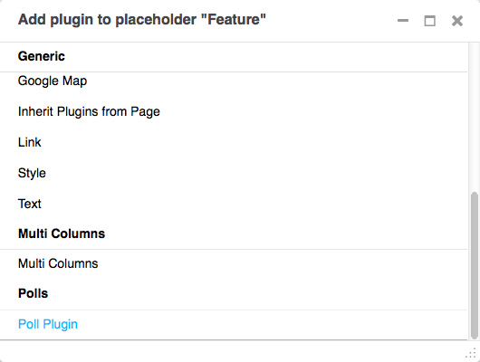

.. title: DjangoCMS

:data-transition-duration: 500
:css: css/presentation.css
:css: css/impressConsole.css
:css: css/monokai.css

----

:id: intro

.. image:: images/djangocms_logo.png

.. class:: quote

    "Django" y "CMS"
    
.. note::
    * Estoy aquí para hablaros de DjangoCMS, porque me encanta DjangoCMS. Y me gustaría hoy conseguir que a vosotros también os encantase.
    * Pero antes de hablar de DjangoCMS debo hablar de las 2 palabras que componen su nobmre: Django, y CMS.

----

:id: cms

CMS
===

Content Management System
-------------------------
Adm. de contenidos, para los *administradores*, *editores*, *participantes* y demás usuarios del sitio.

.. note::
    * Aunque la mayoría de la gente sepa lo que es, por si acaso lo explico.
    * CMS: un CMS permite a los editores añadir, editar y gestionar contenido. Por ejemplo, noticias.

----

:id: django-def
:data-x: 0
:data-y: r1600

Django
======

.. class:: quote

    "The web framework for perfectionists with deadlines"
    
.. note::
    * Y Django, según sus propios creadores, es "The web framework for perfectionists with deadlines"
    * Lo que vendría a significar, un framework web en Python con gente con un gran ego.

----

:id: framework-def
:data-x: r1600
:data-y: r0

Framework
=========
*Estructura conceptual* y tecnológica de soporte definido, normalmente módulos concretos y *herramientas para el desarrollo*.
    
.. note::
    * Vale, ¿pero qué es un framework?
    * Es un método de trabajo establecido haciendo uso de unas herramientas predefinidas.
    
----

:id: django-features
:data-x: 0
:data-y: r1600

Algunas de las herramientas que ofrece Django...
================================================

* **Admin**
* **ORM** (``models.py``)
* **Templates**
* Sis. **vistas** genéricas (``views.py``)
* **Middleware**
* Sis. de **urls** (``urls.py``)
* Sistema de **usuarios**...

.. note::
    * Y ahora, perdonad que me centre un poco más en qué herramientas son esas, para entender un poco Django, antes de DjangoCMS...
    * Admin: gestión de los registros de la base de datos.
    * ORM. Mapeo de datos de la base de datos a clases.
    * Templates: tiene su propio sistema de templates.
    * Vistas: procesan la petición para dar una respuesta.
    * Middleware: pasos anteriores y posteriores en el procesado de una petición y respuesta.
    * Urls: Relacionan las urls con las vistas.

----

:id: djangocms-def
:data-rotate: 90

DjangoCMS:
==========

Complementa a Django como framework
-----------------------------------

Pero con herramientas para CMS
^^^^^^^^^^^^^^^^^^^^^^^^^^^^^^

.. note::
    * Y ahora sí que sí. Vamos con DjangoCMS.
    * Si hemos dicho que Django es un framework, DjangoCMS lo que hace es complementar ese framework con herramientas para hacerlo un CMS.

----

:id: djangocms-features

Herramientas que ofrece DjangoCMS
=================================

* Sistema de *menús jerárquico* y *multiidioma*.
* Gestión y creación de *páginas*.
* *Borradores y publicación* de contenido.
* Sistema de *versiones*.
* *Contenido multiidioma* y condicionado por el mismo.
* Gestión de los *Apphooks* y los *plugins* (que hablaremos más adelante).

.. note::
    Qué herramientas nos ofrece DjangoCMS:
        
        * ...

----

:id: demo-1
:data-rotate-x: -90

Una pequeña demostración...
===========================

.. note::
    Y ahora una pequeña demostración para que se vea de qué hablamos...
    
        * https://demo.django-cms.org
        * Podéis acceder a esta misma url desde vuestras casas para probar esta misma demo.

----

:id: cms-howto
:data-rotate-x: 0

Cómo usar DjangoCMS
===================

Podemos usar DjangoCMS en un proyecto Django ya existente con muy pocos cambios.

* Añadir los componentes al :code:`INSTALLED_APPS`.
* Añadir los **middleware** y **context processor**.
* Añadir al :code:`urls.py`.
* Etiquetas DjangoCMS en **template** base.
* Definir templates.

|

Más información: http://docs.django-cms.org/en/release-3.4.x/how_to/install.html

.. note::
    * Y hasta aquí la demostración. Ahora vamos a lo importante: cómo usarlo.
    * Puede que alguno de vosotros haya usado Django. O incluso tenga un proyecto. Veremos que añadirle DjangoCMS es fácil.
    * <listar cosas a hacer>

----

:id: cms-templates-changes
:data-z: 2200
:data-y: r0
:data-rotate-y: -45

Cambios en templates
====================

En el template base, debemos poner las etiquetas:

* ``placeholder/placeholder_static``
* ``show_menu``
* ``render_block`` (Sekizai)

.. note::
    * Como los otros puntos son algo que podría pedirse con cualquier otro módulo de Django, voy con lo que de verdad supone un cambio, aunque sea pequeño. El template.
    * <listar cambios a hacer>

----

:id: placeholder-def
:data-x: r1600
:data-y: r1600
:data-z: r0
:data-rotate-x: 0
:data-rotate-y: 0

Placeholder
===========
Permite definir dónde irán los plugins *(bloques, widgets)*.

.. code:: htmldjango

     
     

         
     

     

         
     

     

         
     

    
    
    
    

        
    

    
    
El **identificador** (primer argumento) permite *reutilizar secciones* entre diferentes templates.

.. note::
    Los placeholder y placeholder_static permiten definir dónde irán los plugins en nuestra página. El argumento entregado define el identificador de placeholder, que permite reutilizarlos entre templates.
    
----

:id: placeholders-types
:data-x: r1600
:data-y: r0

Placeholder y placeholder_static
--------------------------------

Además, podemos diferenciar entre:

* **Placeholder:** Va *asociado a una página* en concreto o contenido. Por ejemplo, un artículo de blog sobre un concierto, puede tener al lado un plugin de botón para reservas.
* **Placeholder static:** Se muestra en *todas las páginas* que tengan el identificador de placeholder, sin diferenciar contenido. Por ejemplo, un plugin que se mostrará en TODOS los artículos de blog, con publicidad.
    
.. note::
    Existen 2 tipos de placeholder:
    
    * placeholder: va asociado a página o instancia del modelo. Los plugins que se pongan sólo aparecerán en dicha página.
    * placeholder static: permite reutilizar todos los plugins que se pongan en él en todas las páginas y templates que compartan el mismo identificador de placeholder.    
    
----

:id: placeholder-static-ex
:data-x: r0
:data-y: r0
:data-rotate-x: 90

Ejemplos de placeholder static
==============================

* Un placeholder **footer**, que se hereda en todos los templates, que tendrá un plugin de texto con el aviso legal de la página.
* Un placeholder **blog_header** que se usa sólo en los templates de una app blog.
* Un placeholder **blog_article_comments**, que se mostrará sólo en el template de article de blog.
   
.. note::
    <leer ejemplos>

----

:id: placeholder-ex
:data-x: r1600

Ejemplos de placeholder
=======================

* Un placeholder **content**, que es donde va el contenido de un artículo o noticia.
* Un placeholder **feature**, que irá al lado del artículo. Por ejemplo, *"¡Reserva ya las entradas para este evento!"*
   
.. note::
    <leer ejemplos>
   
----

:id: placeholders-image

Al editar una página, podremos visualizar los placeholders en los que podremos añadir plugins.

.. image:: images/new-placeholder.png

.. note::
    Diferenciar static y normal por la chincheta.

----

:id: show-menu-def
:data-x: r0
:data-y: r1600

Show_menu
=========

Renderiza los menús de DjangoCMS.

.. code:: htmldjango

    

    <ul class="nav navbar-nav">
        
    </ul>
    
.. note::
    No tiene mucho misterio. Renderiza el menú usando el template de menú dado. Puede haber más de un menú, y submenús.

----

:id: sekizai
:data-x: r3200
:data-y: r0

Sekizai
=======

Módulo para Django que permite **añadir dinámicamente JS y CSS**, evitando duplicados (si no lo estás usando en tu proyecto, ya estás tardando).

.. code:: htmldjango

    
    ...
    <head>
        
    </head>
    <body>
        
    </body>
    
.. note::
    Un complemento imprescindible para Django. ¿No sabes cómo unificar la definición de assets en la página? ¿Se carga varias veces un script en tu página? Sekizai te ayuda con ello, uses DjangoCMS o no. DjangoCMS lo usa para cargar el JS y CSS del modo admin en la página, aunque no es imprescindible.

----

:id: cms-dev
:data-rotate-x: 0
:data-x: r3200
:data-y: r3200

Desarrollo con DjangoCMS
========================

Tenemos principalmente:

- **Apphooks**
- **Plugins**

|

Además de otras herramientas como:

- Menús
- Wizards
- ...

.. note::
    Y ahora, cómo podéis crear cosas para DjangoCMS, o cómo contribuir a los addons ya existentes.
    
        * Los más importantes que podemos diferenciar son Apphooks y Plugins.

----

:id: apphooks-def
:data-x: r0
:data-y: r1600

Apphooks
========

Similares a las apps de Django, tienen un ``urls.py``, *mismos views, mismos templates...* pero con la posibilidad de **añadirlos de forma dinámica** asociados a una url de partida. Por ejemplo, ``/blog/``.

.. note::
    Son como las Apps de Django, pero reutilizables, configurables, y se añaden de forma dinámica y cuantas veces queramos.

----

:data-x: r-1600
:data-y: r0

Ejemplos:
---------

* Una app **blog**. Podremos añadir tantas apps blogs a nuestra web como queramos.
* Una app **personas**. Pueden añadirse varias apps, cada una filtrando qué tipo de personas se mostrarán  (por ejemplo, app personas *"socios"*, y app personas *"junta directiva"*).
* Una app **encuestas** que permite añadir múltiples encuestas. A su vez habrá plugins que permitirán incluir una encuesta en una página.

.. note::
    Algunos ejemplos... Por ejemplo podemos tener una app blog para añadir... <seguir leyendo>

----

:id: apphooks-usage
:data-rotate: r90

Cómo se añaden en la interfaz
=============================

Creando una página nueva. Por defecto, DjangoCMS crea páginas de **CONTENIDO**, pero es posible cambiarlo para que sea una app.

1. Se **crea una página** *blog*, con url ``/blog/``.
2. Tras crearse la página, se va a **avanzado** y se **elige la app**, en este caso la de *blog*.
3. Ahora la página es una app, y las urls partirán de la url base de la página.

.. note::

    1. Lo primero, crear una página nueva. Por ejemplo, llamada blog.
    2. Ir a avanzado y en apps, seleccionar la de Blog.
    3. Listo.

----

:id: apphooks-ex
:data-x: r0
:data-y: r-1600
:data-rotate: r0

Ejemplos:
---------

* ``/blog/``: portada del blog.
* ``/blog/c/software-libre``: Categoría software libre.
* ``/blog/ahora-uso-django-cms/``: Entrada en el blog.

.. note::
    Algunos ejemplos de las urls, si la página la hemos creado como /blog/.

----

:id: create-apphook
:data-x: r1600
:data-y: r-1600

Crear una AppHook
=================

Adaptando Django polls, app del tutorial de Django
--------------------------------------------------

Convertiremos una app de Django en una AppHook de DjangoCMS, para poder **añadirla dinámicamente** con la interfaz web.

.. note::
    Seguramente a quienes hayan seguido el tutorial de Django, les suene la App Polls. Vamos a modificarla para integrarla en DjangoCMS.

----

:id: create-apphook-warning
:data-x: r0
:data-y: r-800
:data-z: r2000

.. class:: warning

    *Ojo:* Pueden aprovecharse las herramientas de DjangoCMS sin necesidad de que la app sea una AppHook. Esto es sólo para poder añadirlo dinámicamente.

.. note::
   Aclarar que no es necesario convertirla en un Apphook para poder usarla junto con DjangoCMS. Esto es sólo para poder añadirla dinámicamente.
    
----

:id: apphook-polls-intro
:data-x: r0
:data-y: r-1600
:data-z: r0
:data-rotate: r0
:data-rotate-x: 0
:data-rotate-y: 0

Nuestra App *polls* tiene:
==========================

* Un archivo ``models.py`` con el esquema de la **base de datos** y los métodos .
* Un archivo ``admin.py`` con  las clases para **administrar** los modelos.
* Un archivo ``views.py`` con las funciones y clases que **procesan** las peticiones web, para devolver unas respuestas.
* Un archivo ``urls.py`` que relaciona los **patrones de urls** con las vistas que ejecutarán.
* Un directorio ``templates/`` con los **archivos html** para visualizar el resultado de las vistas.

.. note::
    En nuestra app de polls tenemos lo siguiente... <leer>

----

:id: demo-2

Echemos un vistazo...
=====================

.. note::
    Ahora, vamos a ver cómo es antes de modificarla...

----

:id: apphook-polls-urls
:data-rotate: r45

Convirtiendo nuestra App en una AppHook
=======================================

Primero, comentaremos del archivo ``proyecto/urls.py`` la importación de nuestro urls, porque ya no lo necesitaremos. Ahora lo gestionará DjangoCMS con su AppHook.

.. code:: python

    from django.conf.urls import url, include
    from django.contrib import admin

    urlpatterns = [
        url(r'^admin/', admin.site.urls),
        url(r'^polls/', include('polls.urls')),  # <-- la comentamos
    ]

.. note::
    En nuestro proyecto original, para poder usar la App, hemos tenido que añadir su urls al urls del proyecto. Ya no necesitaremos esto, porque ahora se encargará DjangoCMS.
    
----

:id: apphook-polls-cms-apps
:data-rotate: r0
:data-x: r1600

cms_apps.py
===========
En este archivo se definen los AppHooks que se podrán añadir desde la interfaz web. En nuestro caso:

.. code:: python

    # cms_apps.py
    from cms.app_base import CMSApp
    from cms.apphook_pool import apphook_pool
    from django.utils.translation import ugettext_lazy as _

    class PollsApphook(CMSApp):
        name = _("Polls Apphook")

        def get_urls(self, page=None, language=None, **kwargs):
            return ["polls.urls"]  # Ahora el urls de la app se carga con esto

    apphook_pool.register(PollsApphook)

.. note::
    Y esta es la parte importante del cambio: hemos añadido un archivo nuevo a la app llamado cms_apps.py, con la definición de la app. Véase el urls que hemos comentado antes.
    
----

:id: demo-3
:data-rotate: 0
:data-x: r0
:data-y: r-1000
:data-z: 0
:data-rotate-x: 0
:data-rotate-y: 0

Eso es todo
===========
Tras esto nuestra App ya es un Apphook. **Sin más cambios necesarios**.

Veamos ahora cómo queda...
--------------------------

.. note::
    Y esto es todo lo realmente necesario. No hemos tocado ni los modelos, ni el admin, ni los views, ni el urls ni el templates. Sólo hemos añadido un archivo. Ahora veamos el resultado.

----

:id: djangocms-ending-1
:data-x: r4000
:data-y: r2300
:data-z: r0
:data-rotate: r0
:data-rotate-x: r0
:data-rotate-y: r0

DjangoCMS es
============
respetuoso con Django.
----------------------

No se solapa con el mismo
^^^^^^^^^^^^^^^^^^^^^^^^^

No lo modifica
""""""""""""""

Lo complementa
""""""""""""""

.. note::
   Así pues, DjangoCMS a diferencia de otros sistema de CMS para Django, lo complementa sin llegar a modificarlo. Es respetuoso con el propio Django.

----

:id: djangocms-ending-2
:data-x: r0
:data-y: r600
:data-z: r1200

DjangoCMS
=========

* Usa el **admin** de Django.
* Mismo sistema de **modelos**.
* Mismo sistema de **urls**.
* Mismos **views**.
* Mismos **templates**.

.. note::
    Y tal y como hemos visto, DjangoCMS reutiliza los elementos ya existentes de Django. Véase... <leer>

----

:id: plugins
:data-x: r1600
:data-y: r1600
:data-z: 0

Plugins
=======
Son el equivalente a los **widgets** de otros CMS.

**Bloques** que se integran en las páginas y *pueden reordenarse*.

.. note::
   Al igual que en otros CMS, en DjangoCMS hay bloques, a los que se denomina widgets, que se integran en las páginas, pudiéndose añadir, eliminar, modificar o reordenar cuando se desee.
    
----

:id: create-plugins
:data-x: r1600
:data-y: r0

Creación de plugins
===================

models.py
---------
Modelo para el almacenamiento de la **configuración del plugin**.

.. code:: python

    class PollPluginModel(CMSPlugin): # <<- Hereda de Model
        poll = models.ForeignKey(Poll)
        # Más campos de configuración...

        def __unicode__(self):
            return self.poll.question

.. note::

    No me voy a entretener demasiado en esto por falta de tiempo. Sólo repasaré por encima lo necesario. Lo primero, un modelo con la configuración del plugin.
    
----

:id: cms-plugins-1
:data-x: r0
:data-y: r1600

cms_plugins.py
==============
**Definición** del plugin para su uso. Incluye **renderizado** y todo lo necesario.

.. code:: python

    class PollPluginPublisher(CMSPluginBase):
        model = PollPluginModel  # El modelo de antes con la config.
        module = _("Polls")
        name = _("Poll Plugin")  # Nombre en el listado de la interfaz
        # El template con el que se renderizará el template
        render_template = "polls_cms_integration/poll_plugin.html"

        def render(self, context, instance, placeholder):
            context.update({'instance': instance})
            return context

    plugin_pool.register_plugin(PollPluginPublisher)  # registro del plugin
    
.. note::
    Y creamos un nuevo archivo, cms_plugins, con la declaración del plugin. Éste se encarga tanto de la declaración como el renderizado.

----

:id: cms-plugins-2

.. note::
    Y tras crearlo, podremos añadirlo como un plugin más. Cuando se crea, se nos pedirá configurarlo rellenando los campos del modelo de configuración.
    
----

:id: references
:data-rotate: 360
:data-z: 800
    
Referencias
===========

* **Página oficial**: https://www.django-cms.org/en/
* **Documentación**: http://docs.django-cms.org/en/latest/
* **Extras:** https://marketplace.django-cms.org/en/addons/

.. note::
    Algunas referencias por si queréis empezar con DjangoCMS.
    
----

:data-z: 0
:data-scale: 5
:data-rotate-y: 60

¿Quieres probar DjangoCMS?
==========================

* **Tu proyecto en la nube:** https://www.divio.com/en/
* **Usa su demo:** https://demo.django-cms.org

.. note::
    Y ahora, si queréis trabajar con DjangoCMS, podéis hacerlo en la nube, o podéis probarlo antes con la demo.

----

:data-scale: 1

Sobre esta presentación...
==========================

* **Código fuente presentación:** https://github.com/Nekmo/djangocms-presentation
* **Código fuente app polls modificada:**: https://github.com/Nekmo/djangocms-ejemplo
    
.. note::
    si te ha gustado la presentación, puedes verla en mi Github, y no olvidéis darle a like :)

----
    
:id: end

¡Muchas gracias a todos!
========================

* **Sitio web:** http://nekmo.com
* **Email:** contacto@nekmo.com
* **Telegram:** @nekmo
* **Twitter:** @nekmocom

.. note::
    Muchas gracias. Por si queréis hablar conmigo, podéis hacerlo por estos medios, o luego al final.
